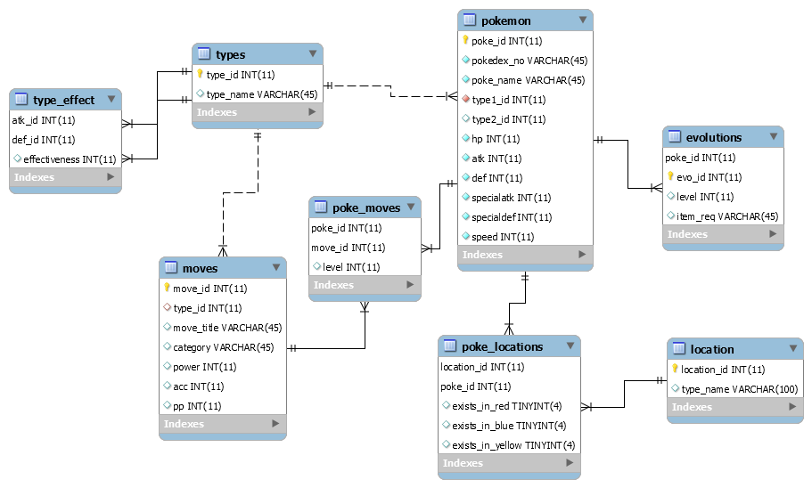
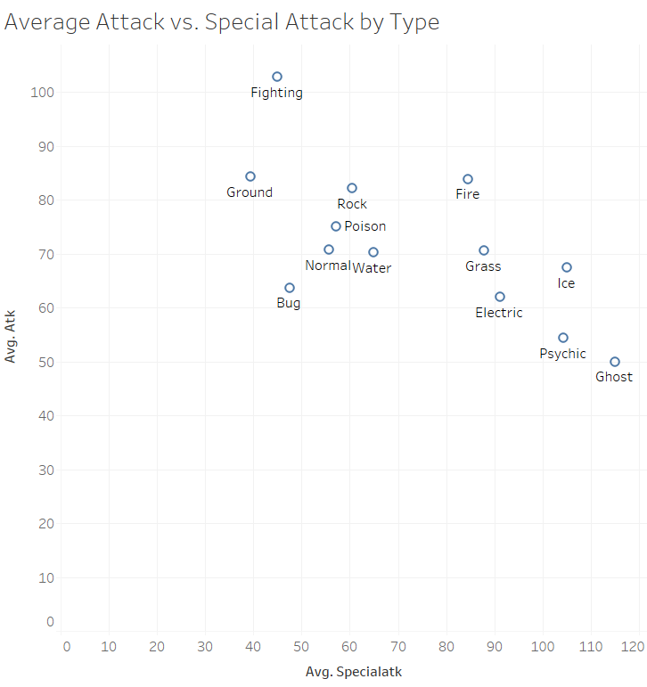

# pkmn_db
A Generation 1 Pokemon Database created for INST327

This project was jointly designed by Brecken Keller, Brigidanna Crews, Tyson Nguyen, and Steven O’Ferrall at the University of Maryland - College Park.

Data was imported using https://pokemondb.net and all rights to the data belong to The Pokemon Company. 

How to Use:
Run pkmndbfinal.sql in an active MySQL server to create the database, structure, and data.

Schema Model:
Schema designed by Brecken Keller

Example Exploratory Analysis:

